<div align="center">

<h1>XileHUD (Beta)</h1>

Lightweight PoE1 and PoE2 item & modifier overlay – copy an item, see the data instantly.<br/>
<a href="https://github.com/XileHUD/poe_overlay/releases/latest">⬇ Download the Latest Release</a><br/>
<sub>Windows x64 • Installer + Auto‑Update • Local-First • Privacy Focused</sub>

<br />

<a href="https://discord.gg/9BUAW92AZv">💬 Join our Discord</a> • <a href="https://www.reddit.com/r/PathOfExile2/comments/1o1ed0n/i_was_frustrated_with_the_limited_merch_history/">Reddit Discussion</a>

<br />

<a href="https://www.youtube.com/watch?v=S_K_4U-rByU" target="_blank" rel="noopener noreferrer" title="Watch the latest XileHUD feature showcase on YouTube">
	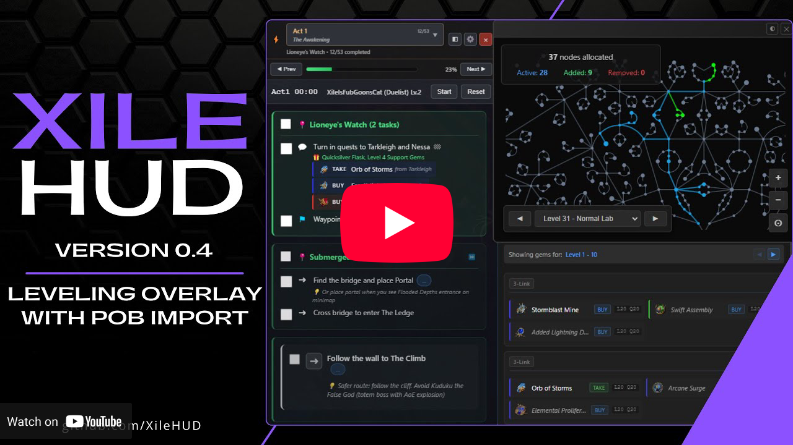
</a><br/>
<sub><a href="https://www.youtube.com/watch?v=S_K_4U-rByU" target="_blank" rel="noopener noreferrer"><em>Latest video: Leveling Overlay + PoB Integration</em></a></sub>

<br />

<sub><a href="https://youtu.be/m6PkfTIK-1E" target="_blank" rel="noopener noreferrer"><em>Previous video: Full PoE1 & PoE2 Support Overview</em></a></sub>

<br />


</div>

---

## What is XileHUD?

I initially created this HUD for my personal use. As a self-employed trader, I spend a lot of time on the PC, and Path of Exile is the perfect game for that. I've been coding as a hobby for some years now, mainly building tools that help me get things done faster. A friend saw the overlay and told me I should release it to the public, so here we are. I hope you find it as useful as I do!

---

## ✨ Features

### Leveling Overlay
A comprehensive leveling companion for both PoE1 (Acts 1-10) and PoE2 (Acts 1-7). The overlay provides optimized step-by-step guides with automatic zone detection via Client.txt monitoring, so you never miss a quest reward, waypoint, or trial.

**Key Features:**
- Complete act-by-act guides for PoE1 and PoE2
- Auto-detection of zone changes with progress tracking
- Full Path of Building integration: import builds and view recommended gems, passive tree progression, gear sets, and notes
- Floating windows for gems and passive tree with interactive zoom/pan controls
- Multiple view modes: Normal, Minimal (compact header), and Ultra-Minimal (click-through overlay)
- Speedrun timer with run history database, comparisons (best/previous/average), and detailed statistics
- Customizable hotkeys for navigation, passive tree toggle, and gems window toggle
- Leveling-only mode for minimal resource usage

_Images coming soon_

### Merchant History
One of the core motivations for this project. In-game, the vendor history is capped at the last 100 items and doesn't show the items themselves. XileHUD provides a local, searchable, and filterable history of your merchant interactions, allowing you to save and analyze more than just the last 100 transactions. Over recent versions, more filter options and quality-of-life features have been continuously added.


<sub>*Note: At the time of writing, the new PoE1 league has not yet started, but Merchant History will be fully supported from day one.*</sub>

### Merchant History Insights
Merchant history filters power more than just the table: currency totals, trade counts, and the earnings graph now rebuild from the filtered dataset, keeping every stat perfectly aligned with the data slice you're studying.

### Detailed Modifier Overview
Get an in-depth look at item modifiers with advanced filters, weighting, and more. Instantly understand the power of an item. Every possible filter option has been added, allowing you to see every modifier that can spawn on a specific item. 

Supports influences, new league crafting mechanics, and essentially everything imaginable with finely-tuned filter options.

**PoE1:**

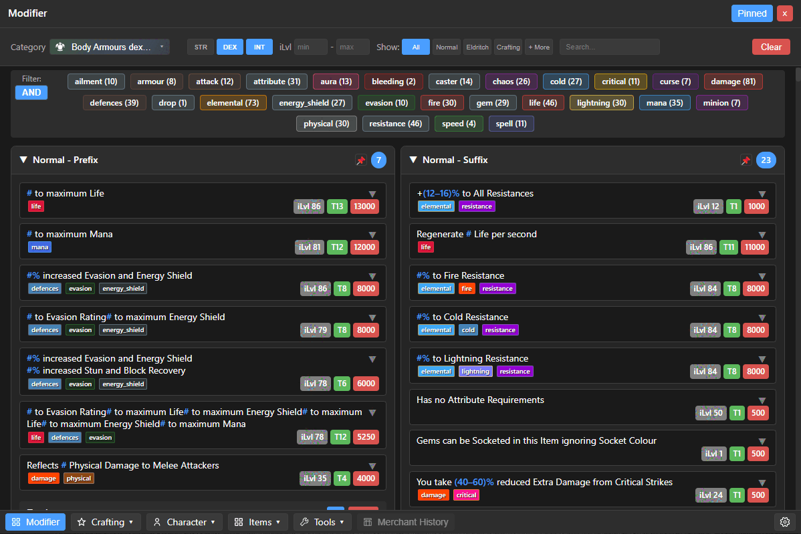

**PoE2:**

With the new Whittling Helper, you can continue your hotkey workflow exactly as before, but now the header gains a dedicated "Whittling" label. Hovering over it reveals every affix the overlay parsed—including their tiers, item level requirements, and which modifier would be whittled. The target line is highlighted in orange so you know precisely what you're locking in.

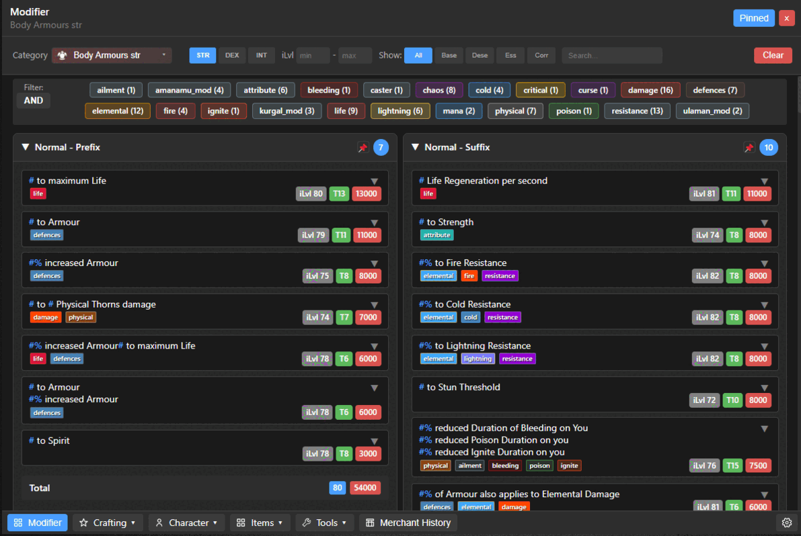

### Crafting Currency Helper
Ever wondered about the different Essences, Omens, or Scarabs available? Instead of manually searching the trade site, simply press Ctrl+Q (or your configured hotkey) on any currency or item to see a detailed, filterable list of what they do.

**PoE1:**

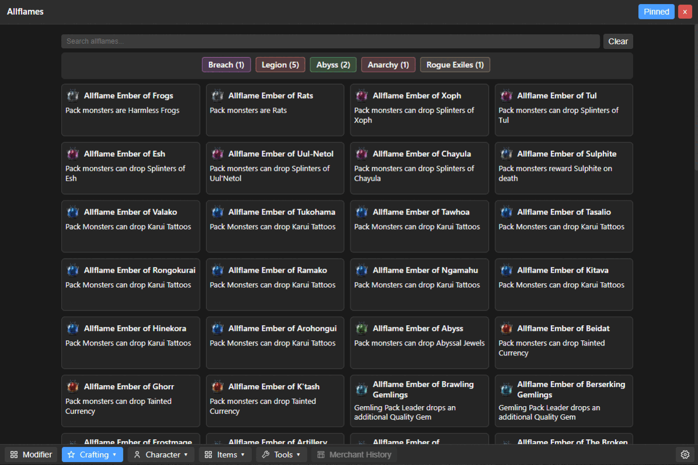

**PoE2:**

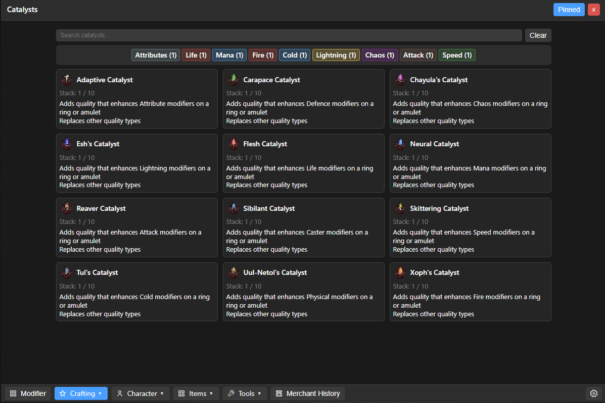

### Smart Clipboard
The overlay is intelligent. If you copy a rare Strength-based chestplate, for example, the modifiers page will automatically open with the "STR Chest" category pre-selected. This functionality extends to Omens, Essences, Catalysts, Uniques, Flasks, Relics, Scarabs, and much more, saving you valuable clicks. 

### Character Planner
View all available Gems with detailed Gem pages that show level progression and visual graphs, Atlas Passives, Keystones, Anointments, Tattoos, and Ascendancy passives. Filter everything to your needs to plan your next build or optimize your current one. A comprehensive glossary is also included.

**PoE1:**

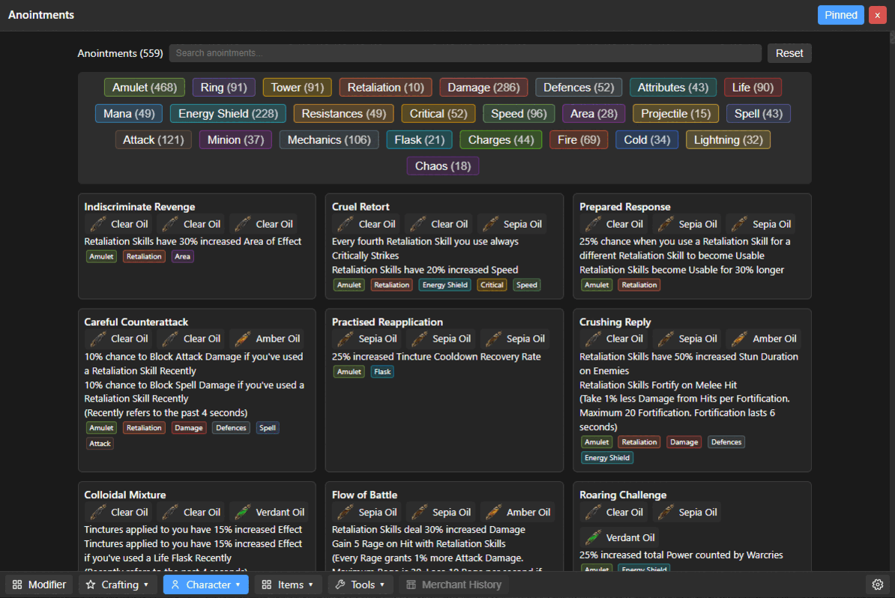

### Quest Passives Helper
With the absence of the `/passives` command in PoE2 and the increased number of campaign rewards, this tool is essential. Track and filter all sources of Spirit, passive points, resistances, and attributes. Check them off as you collect them to ensure you never miss a permanent character boost.

**PoE2:**

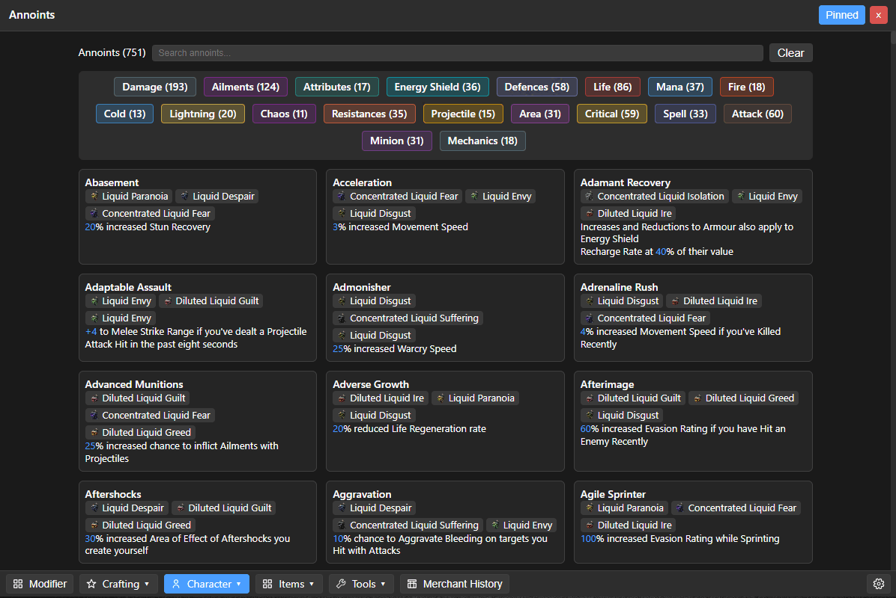

### Item Database
Browse all base items and Uniques in the game through a clean, organized interface with powerful filtering options. For instance, find the highest evasion base armor with just a few clicks.

### Base Browser → Modifiers Jump
From the Bases browser, you can now jump straight into the relevant modifier list with a single click. Look up a base, tap the new "View modifiers" shortcut, and the overlay pivots directly to the matching category so you can evaluate tiers without searching manually.

**PoE1:**

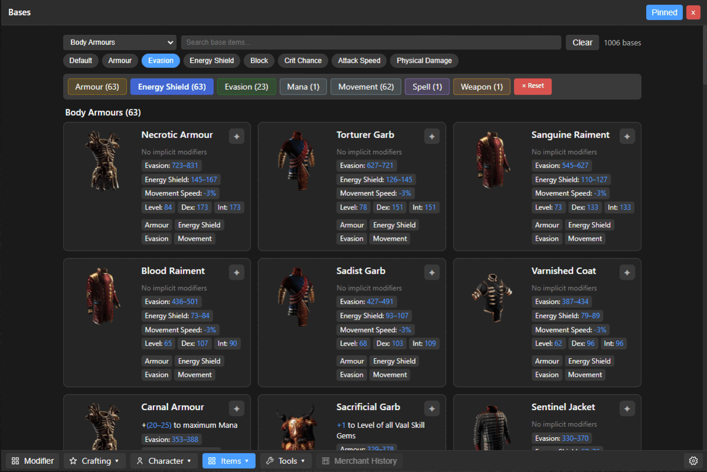

**PoE2:**

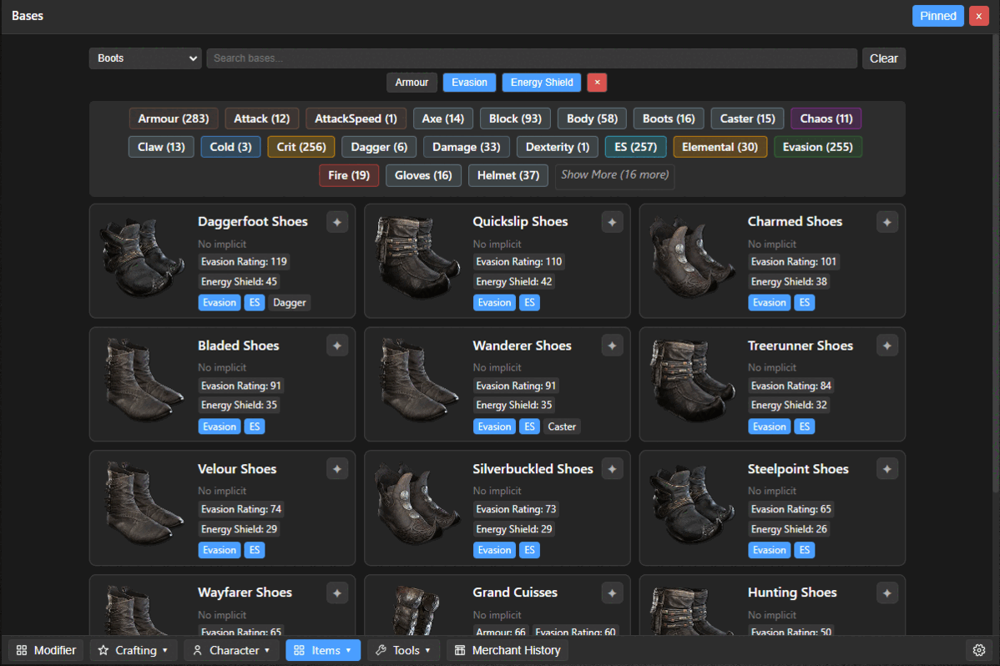

### Map Regex Tool
A simple tool to make juicing maps more straightforward. Select the mods you want or don't want, and copy the generated regex directly into the game.

**PoE1:**

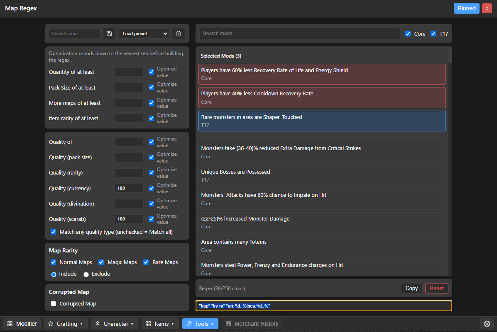

### Unified Settings Screen
All preferences live in a single, keyboard-friendly Settings hub: manage hotkeys, overlay themes, capture behavior, and advanced options without digging through configuration files.

### Feature Selector
Quickly tailor the overlay to the features you actually use. Toggle whole modules on or off, reorder their priority, and keep your HUD lean during leagues when you only care about a handful of systems.

**PoE1:**

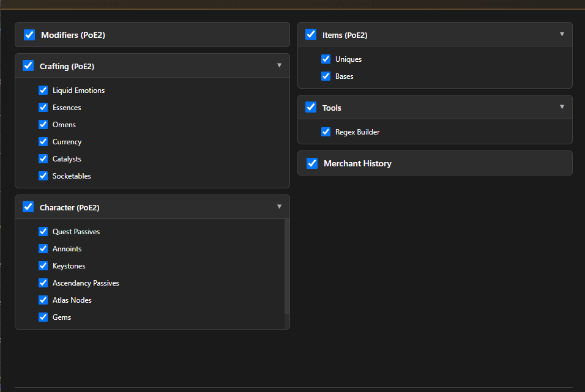

### Fuzzy Search Everywhere
Every major data panel now supports fuzzy matching. Type fragments or abbreviations ("ev armor", "anc ra") and the overlay ranks the closest hits instantly, so you never have to remember the exact wording of an item base, quest, or modifier.

### Focused Gaming
The overlay is designed to be unobtrusive and can be quickly toggled with a hotkey, keeping you focused on the game.

### Local Database
Most features are fully local and can be used offline. An internet connection and account authentication are only required for the Merchant History to fetch your data from the PoE servers.

---

## 🚀 Quick Start

Download the installer (`XileHUD-Setup-x.y.z.exe`) from the [Releases](https://github.com/XileHUD/poe_overlay/releases/latest) page and run it (first run of an unsigned build: Windows SmartScreen → “More info → Run anyway”). Then:

**Select Game Version**  
On first launch, choose whether you want to use the PoE1 or PoE2 version. You can always change your selection in Settings later. The overlay only loads features for the selected version to maximize performance, but you can easily switch between both on the fly.

**Primary Hotkey (Ctrl+Q)**  
In-game (Windowed or Borderless Fullscreen), simply hover your mouse over any item (gear, essence, omen, socketable, scarab, etc.) and press `Ctrl+Q`. The overlay automatically copies the item in the background and shows the correct panel instantly—no manual copy, no extra clicks. 

If the copy doesn't work for you, it's most likely because PoE is running in admin mode. Windows does not allow non-admin applications to execute `Ctrl+C` in admin-privilege programs. Either start PoE without admin rights or start XileHUD in admin mode. 

**On-Screen Button (No Hotkey Mode)**  
Right-click the tray icon to spawn a draggable on-screen button. Place it anywhere, pin it if you like, and left-click it while hovering an item to capture and display that item. Great for relaxed mapping or controller/couch setups.

**Toggling & Capturing**  
- `Ctrl+Q` when overlay is hidden: capture hovered item & show overlay.  
- `Ctrl+Q` again (if not pinned): hide overlay.  
- While pinned: subsequent `Ctrl+Q` (or button clicks) replace the content without hiding.

**System Tray**  
- Left click: show/hide overlay  
- Right click: quit/options (including enabling the capture button)  
- Open **Settings** from here (or `Ctrl+,`) to access the feature selector, hotkey tweaks, and overlay preferences.

**Updates**  
Future versions auto-download silently and apply when you exit the app; your settings and merchant history remain intact.

---

## 🔒 Privacy

No telemetry or tracking is implemented. Account authentication is only required if you wish to use the Merchant History feature to fetch your data from your Path of Exile account. All other features work offline.

---

## 🗺️ Roadmap

I usually add features that I personally think would help me save time, so when you see an update, it's likely something I'm actively using myself.

**New / High-Priority Ideas:**
- **Unique Drop Source Tags:** Display where each Unique item drops (boss, encounter, league mechanic) to support target-farming and planning.
- **Leveling Overlay:** Route planner with act/zone splits, boss prep tips, and automatic progress detection (so you never miss a quest reward or passive point while rushing).
- **Speedrun Timer:** Lightweight in-overlay timer with segment splits (acts, key bosses) and auto-split hooks planned when reliable triggers are identified.
- **"Today I Learned" Knowledge Base:** Curated micro-tips (e.g., how to cheaply get a level 21 gem)—community aggregated, surfaced contextually later.

**Existing / Ongoing:**
- **Spectre Database:** A comprehensive list of spectres and their abilities.
- **Shareable Crafting Recipes:** Create and share crafting processes with the community.
- **Expanded Regex Tool:** Add more categories for deeper customization.
- **And much more!** Many other ideas are in development to continue making our lives in Wraeclast easier.

**Future / Exploratory:**
- **Exchange Prices Integration:** Optional toggleable pricing data (overlay remains fully functional offline if disabled).
- **Top Builds Browser:** View popular builds for each class directly in the overlay for build inspiration.
- **Mobile Companion App:** Primarily for Merchant History on-the-go; also useful for console players to browse their trade data.

**Technical Improvements** (moved to bottom for clarity):
- ✅ ~~Modularize history module~~ (Complete: reduced from 1,279 → 215 lines, 11 focused modules)
- Modularize overlay.html more
- Further refactor main.ts: Continue code cleanup and organization

---

## ❓ WIP FAQ (Work in Progress)

<sub>Early, evolving list. Content will expand as common questions come up. Nothing here is marketing fluff – just straight answers.</sub>

<details>
<summary><strong>Is this all within GGG's ToS?</strong></summary>
<p>
XileHUD is basically just a visual wrapper for official data—think of it as a nice-looking browser. All the modifier data and subpages are local JSON files I curated, so nothing is ever read from the game itself. It's basically 100% the same as opening PoEDB in your browser while playing.

The only online part is the Merchant History. It’s the same data you get when you open the trade history website (trade2/history); we just display the official API data in a cleaner, more usable format. There is no extra data beyond what the site provides.

Item detection is built on GGG's own copy feature. When you press Ctrl+(Alt)+C on an item, the game copies its data to your clipboard—XileHUD just reads that text, like all price checkers (Exiled Exchange, Awakened PoE, Sidekick, etc.) do.

So nothing in XileHUD violates GGG's ToS. I've read them many times and made sure everything stays fully compliant. The tool was originally made for my own use. GGG will never officially endorse third-party tools since developers could change the code at any time, but they do check for ToS compliance. I also contacted them directly by email to let them know XileHUD exists, and the Reddit thread about it reached over 500 upvotes, so I'm quite certain they're aware of it.

Keep in mind that I'm not GGG, so like with any third-party tool, you always use it at your own risk. That applies to every external tool out there. I personally won't add any feature unless I'm absolutely certain it's allowed—I'm not interested in touching any grey areas. I love my account too much.
</p>
</details>

<details>
<summary><strong>Why don't you integrate a price check?</strong></summary>
<p>
I considered it. In my private version, there is one because I don't like waiting on features I personally need. I left it out publicly because there are already overlays that do price checking very well. I personally recommend <em>Exiled Exchange</em> (and <em>Awakened PoE</em> for PoE1)—in my opinion, the best option: slim and feature-complete.
</p>
</details>

<details>
<summary><strong>Any other features planned?</strong></summary>
<p>
Check the roadmap. I have many ideas because I actively play every day. The current version is a beta—I'll keep adding things I personally find useful over time.
</p>
</details>

<details>
<summary><strong>How long have you played PoE?</strong></summary>
<p>
Over a decade. I started a bit after beginning my self-employed work. My job involves a lot of "observing", which makes it perfect to play games alongside. I think GGG is the best gaming company in the industry; I love their games and don't see myself switching to anything else as a main game.
</p>
</details>

<details>
<summary><strong>Do you have any socials for updates?</strong></summary>
<p>
Yes! You can find us on Discord: https://discord.gg/eRY6UMg4
</p>
</details>

<details>
<summary><strong>Are you open to improvements?</strong></summary>
<p>
For sure—performance or new features. I have an open mind; if I think it genuinely improves the overlay, I'll add it.
</p>
</details>

<details>
<summary><strong>Where to contact?</strong></summary>
<p>
Open an issue here on GitHub, or even better, message me on Discord: https://discord.gg/eRY6UMg4
</p>
</details>

---

## 🐞 Reporting Issues

If you encounter a bug or have a suggestion, please create an issue on the **[GitHub Issues page](https://github.com/XileHUD/poe_overlay/issues)**. You can also report issues on Discord: https://discord.gg/eRY6UMg4

When reporting, please include:

- The application version.
- Steps to reproduce the issue.
- The item text (if it's an item parsing issue).
- Any relevant output from the console.

---
<!-- Build & Contributing sections intentionally removed -->
---

## 📜 License

Licensed under **GNU GPLv3** (see [`LICENSE`](./LICENSE)).

This project is not affiliated with or endorsed by Grinding Gear Games.

---

## Acknowledgements

- [Grinding Gear Games](http://www.grindinggear.com/) – For creating the incredible [Path of Exile](https://www.pathofexile.com/) and many of the file formats used. Please support them and do not reuse their files without permission.
- [OmegaK2](https://github.com/OmegaK2) – The original developer of PyPoE.
- [brather1ng](https://github.com/brather1ng) – For the updated PyPoE fork.
- Chriskang – For the original VisualGGPK2.
- [POEDB](http://poedb.tw/us/) & [POE2.RE](https://poe2.re/) – Invaluable data and references.
- [Siveran](https://github.com/Siveran/siveran.github.io)
- [UIOHook](https://github.com/kwhat/libuiohook)
- [SnosMe](https://github.com/SnosMe/uiohook-napi)

Leveling-Overlay:

- [EXILE-LEVELING](https://github.com/HeartofPhos/exile-leveling)
- [Lailloken (Exile-UI)](https://github.com/Lailloken/Exile-UI)
---

## 🔧 Building From Source

```bash
# Install dependencies
npm install

# Build the application
npm run build

# Start the overlay
npm run start

# Package unsigned installer
npm run dist:unsigned
```

All required data JSON files reside under `data/poe2/<League>/` inside this repository so no external folders are needed.

Environment override (optional): set `XILEHUD_DATA_DIR` to point to an alternate league directory at runtime.

---
