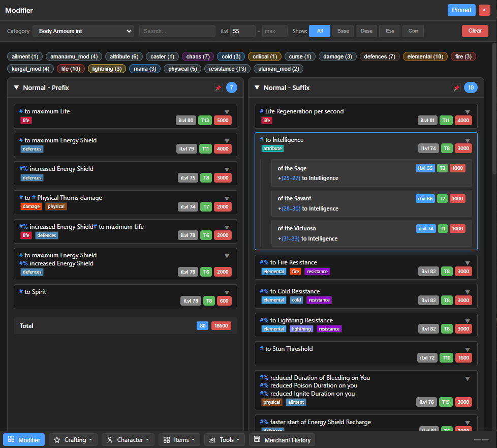
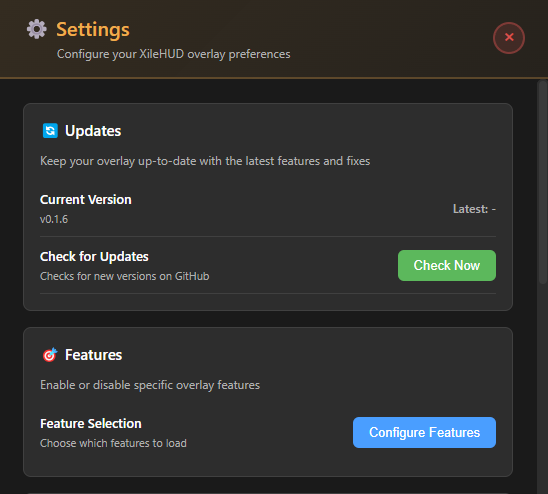

<h1>XileHUD (Beta)</h1>

Lightweight PoE2 item & modifier overlay – copy an item, see the data instantly. 
<a href="https://github.com/XileHUD/poe_overlay/releases/latest">⬇ Download the Latest Release</a> 
Windows x64 • Installer + Auto‑Update • Local-First • Privacy Focused

 

<a href="https://discord.gg/9BUAW92AZv">💬 Join our Discord</a> • <a href="https://www.reddit.com/r/PathOfExile2/comments/1o1ed0n/i_was_frustrated_with_the_limited_merch_history/">Reddit Discussion</a>

 

 
<a href="https://www.youtube.com/watch?v=115H_9t8fiA" target="_blank" rel="noopener noreferrer"><em>Watch a short video overview on YouTube</em></a>

 

<strong>PoE1 Version:</strong> Currently in development, with a planned release before the new league at the end of October.

---

## What is XileHUD?

I initially created this HUD for my personal use. As a self-employed trader, I spend a lot of time on the PC, and Path of Exile is the perfect game for that. I've been coding as a hobby for some years now, mainly building tools that help me get things done faster. A friend saw the overlay and told me I should release it to the public, so here we are. I hope you find it as useful as I do!

---

## ✨ Features

### Merchant History
One of the core motivations for this project. In-game, the vendor history is capped at the last 100 items and doesn't show the items themselves. XileHUD provides a local, searchable, and filterable history of your merchant interactions, allowing you to save and analyze more than just the last 100 transactions.

	

### Detailed Modifier Overview
Get an in-depth look at item modifiers with advanced filters, weighting, and more. Instantly understand the power of an item.

	

### Crafting Currency Helper
Ever wondered about the different Essences, Omens, or Runes available? Instead of manually searching the trade site, simply press Ctrl+Q on any currency to see a detailed, filterable list of what they do.

	

### Smart Clipboard
The overlay is intelligent. If you copy a rare Strength-based chestplate, for example, the modifiers page will automatically open with the "STR Chest" category pre-selected. This functionality extends to Omens, Essences, Catalysts, Uniques, Flasks, Relics, and much more, saving you valuable clicks.

	
	

### Character Planner
View all available Gems, Atlas Passives, Keystones, and Ascendancy passives. Filter everything to your needs to plan your next build or optimize your current one. A comprehensive glossary is also included.

	

### Quest Passives Helper
With the absence of the /passives command in PoE2 and the increased number of campaign rewards, this tool is essential. Track and filter all sources of Spirit, passive points, resistances, and attributes. Check them off as you collect them to ensure you never miss a permanent character boost again.

	

### Item Database
Browse all base items and Uniques in the game through a clean, organized interface with powerful filtering options. For instance, find the highest evasion base armor with just two clicks.

	
	

### Map Regex Tool
A simple tool to make juicing maps more straightforward. Select the mods you want or don't want, and copy the generated regex directly into the game.

	

### Feature Selector
Quickly tailor the overlay to the features you actually use. Toggle whole modules on or off, reorder their priority, and keep your HUD lean during leagues when you only care about a handful of systems.

	

### Fuzzy Search Everywhere
Every major data panel now supports fuzzy matching. Type fragments or abbreviations ("ev armor", "anc ra") and we rank the closest hits instantly, so you never have to remember the exact wording of an item base, quest, or modifier again.

	

### Unified Settings Screen
All preferences live in a single, keyboard-friendly Settings hub: manage hotkeys, overlay themes, capture behavior, and advanced options without digging through config files.

	
	

### Focused Gaming
The overlay is designed to be unobtrusive and can be quickly toggled with a hotkey, keeping you focused on the game.

### Local Database
Most features are fully local and can be used offline. An internet connection and account authentication are only required for the Merchant History to fetch your data from the PoE servers.

---

## 🚀 Quick Start

Download the installer (`XileHUD-Setup-x.y.z.exe`) from the [Releases](https://github.com/XileHUD/poe_overlay/releases/latest) page and run it (first run of an unsigned build: Windows SmartScreen → “More info → Run anyway”). Then:

**Primary Hotkey (Ctrl+Q)**  
In‑game (Windowed or Borderless Fullscreen), just hover your mouse over any item (gear, essence, omen, socketable, etc.) and press `Ctrl+Q`. The overlay auto‑copies the item in the background and shows the correct panel instantly—no manual copy, no extra clicks.

**On‑Screen Button (No Hotkey Mode)**  
Prefer clicking instead of hotkeys? Press `Ctrl+Alt+Q` (or right‑click the tray icon and enable the toggle) to spawn a draggable on‑screen button. Place it anywhere, pin it if you like, and left‑click it while hovering an item to capture & display that item. Great for chill mapping or controller / couch setups.

**Toggling & Capturing**  
- `Ctrl+Q` when overlay is hidden: capture hovered item & show overlay.  
- `Ctrl+Q` again (if not pinned): hide overlay.  
- While pinned: subsequent `Ctrl+Q` (or button clicks) replace the content without hiding.

**System Tray**  
- Left click: show / hide overlay  
- Right click: quit / options (including enabling the capture button)  
- Open **Settings** from here (or `Ctrl+,`) to access the feature selector, hotkey tweaks, and overlay preferences.

**Updates**  
Future versions auto‑download silently and apply when you exit the app; your settings & merchant history remain intact.

---

## 🔒 Privacy

No telemetry or tracking is implemented. Account authentication is only required if you wish to use the Merchant History feature to fetch your data from your Path of Exile account. All other features work offline.

---

## 🗺️ Roadmap

I usually add features that I personally think would help me save time, so when you see an update, it's likely something I'm actively using myself.

New / High-Priority Ideas:
- Unique Drop Source tags for Uniques: Display where each Unique item drops (boss, encounter, league mechanic) to support target-farming and planning.
- Leveling Overlay: Route planner with act/zone splits, boss prep tips, automatic progress detection (so you never miss a quest reward or passive point while rushing).
- Speedrun Timer: Lightweight in-overlay timer with segment splits (acts, key bosses) and auto‑split hooks planned when reliable triggers are identified.
- "Today I Learned" Knowledge Base: Curated micro‑tips (e.g. how to cheaply get a level 21 gem) – community aggregated, surfaced contextually later.

Existing / Ongoing:
- Spectre Database: A comprehensive list of spectres and their abilities.
- Shareable Crafting Recipes: Create and share crafting processes with the community.
- Expanded Regex Tool: Add more categories for deeper customization.
- PoE1 Version: Complete the Path of Exile 1 adaptation.
- And much more!: I have many other ideas in mind to continue making our lives in Wraeclast easier.

Future / Exploratory:
- Exchange Prices Integration: Optional toggleable pricing data (overlay remains fully functional offline if disabled).
- Top Builds Browser: View popular builds for each class directly in the overlay for build inspiration.
- Mobile Companion App: Primarily for Merchant History on-the-go; also useful for console players to browse their trade data.

Technical Improvements (moved to bottom for clarity):
- ✅ ~~Modularize history module~~ (Complete: reduced from 1,279 → 215 lines, 11 focused modules)
- Modularize overlay.html: Break down 1,940-line monolithic HTML file into component partials for better maintainability
- Further refactor main.ts: Continue code cleanup and organization

---

## ❓ WIP FAQ (Work in Progress)

Early, evolving list. Content will expand as common questions come up. Nothing here is marketing fluff – just straight answers.

<strong>Do you plan on releasing a version for PoE1?</strong>

Definitely. I think PoE2 is heading in a great direction now – 0.3 was by far my most‑played league yet. I'm a min/max player who sweats week 1 for mirrors and then juices as hard as possible. That said, PoE1 is still my "main" game. I play Path of Exile about 95% of the time. Sometimes I'll touch LE or TLI for 2–3 days, but that's it. PoE gives me everything I want: blasting, crafting, trading, and all the little details. I released the PoE2 version first because it's the active league I'm playing right now. I'm confident the PoE1 overlay will be ready for the upcoming league release.

<strong>Why don't you integrate a price check?</strong>

I considered it. In my private version there is one, because I don't like waiting on features I personally need. I left it out publicly because there are already overlays that do price checking very well. I personally recommend <em>Exiled Exchange</em> (and <em>Awakened PoE</em> for PoE1) – in my opinion the best option: slim and feature complete.

<strong>Any other features planned?</strong>

Check the roadmap. I have many ideas because I actively play every day. The current version is a beta – I'll keep adding things I personally find useful over time.

<strong>How long have you played PoE?</strong>

Over a decade. I started a bit after beginning my self‑employed work. My job involves a lot of "observing", which makes it perfect to play games alongside. I think GGG is the best gaming company in the industry; I love their games and don't see myself switching to anything else as a main game.

<strong>Do you have any socials for updates?</strong>

Not yet. Let's first see if the overlay is interesting for people. It's a very specific tool aimed more at hardcore (not the game mode) PoE players – though I think there's useful info for beginners too: lots of data and the merchant history. We'll see where it goes.

<strong>Are you open to improvements?</strong>

For sure – performance or new features. I have an open mind; if I think it genuinely improves the overlay, I'll add it.

<strong>Where to contact?</strong>

Open an Issue here on GitHub, reply in the Reddit thread, or (soon) reach out via a small Discord.

---

## 🐞 Reporting Issues

If you encounter a bug or have a suggestion, please create an issue on the **[GitHub Issues page](https://github.com/XileHUD/poe_overlay/issues)**. You can also report issues in the Reddit thread.

When reporting, please include:

- The application version.
- Steps to reproduce the issue.
- The item text (if it's an item parsing issue).
- Any relevant output from the console.

---
<!-- Build & Contributing sections intentionally removed -->
---

## 📜 License

Licensed under **GNU GPLv3** (see [`LICENSE`](./LICENSE)).

This project is not affiliated with or endorsed by Grinding Gear Games.

---

## Acknowledgements

- [Grinding Gear Games](http://www.grindinggear.com/) – For creating the incredible [Path of Exile](https://www.pathofexile.com/) and many of the file formats used. Please support them and do not reuse their files without permission.
- [OmegaK2](https://github.com/OmegaK2) – The original developer of PyPoE.
- [brather1ng](https://github.com/brather1ng) – For the updated PyPoE fork.
- Chriskang – For the original VisualGGPK2.
- [POEDB](http://poedb.tw/us/) & [POE2.RE](https://poe2.re/) – Invaluable data and references.

---

## 🔧 Building From Source

1. Install dependencies (this folder): `npm install`
2. Development run (hot reload main + renderer): `npm run dev`
3. Type check: `npm run typecheck`
4. Package installer: `npm run dist:unsigned` (or `npm run dist` when codesign configured)

All required data JSON files reside under `data/poe2/<League>/` inside this repository so no external folders are needed.

Environment override (optional): set `XILEHUD_DATA_DIR` to point to an alternate league directory at runtime.

---
